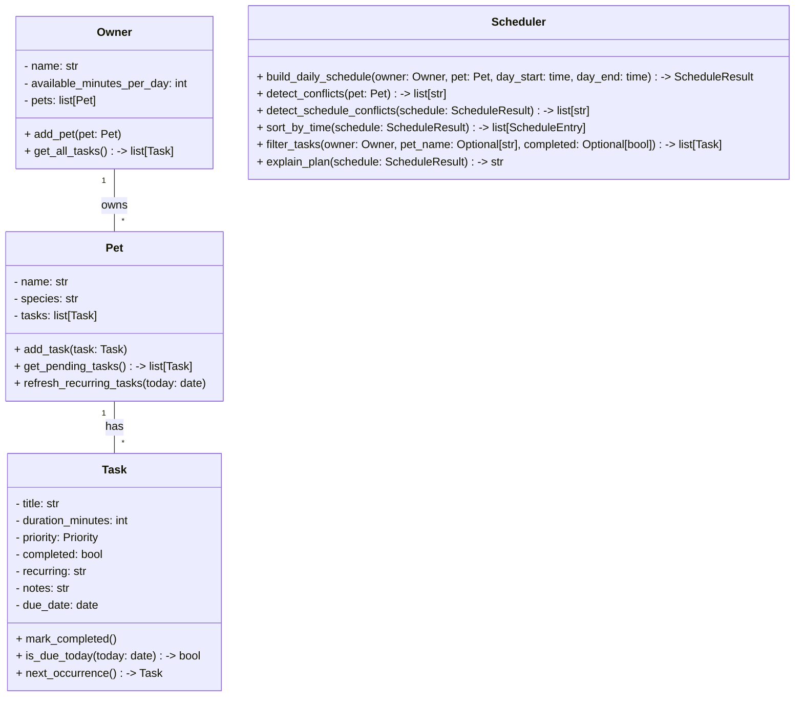

# PawPal+ Project Reflection

## 1. System Design

**a. Initial design**

- Briefly describe your initial UML design.
- What classes did you include, and what responsibilities did you assign to each?

I used four classes. Owner is in charge of storing the person's info and their list of pets. Pet holds the pet's details and keeps track of its tasks. Task stores what needs to be done, how long it takes, and how important it is. Scheduler builds the daily plan based on the owner's available time.

**Add a pet** — the owner enters basic info about themselves and their pet (like the pet's name and type).

**Add care tasks** — the user can create tasks like walks, feeding, or giving meds. Each task has a duration and a priority so the app knows what matters most.

**See a daily plan** — the app takes all the tasks and figures out a schedule for the day. It shows what to do and when, based on how much time the owner has and what the priorities are.

From those actions I came up with four main building blocks:

**Owner**
- Holds: name, how many minutes they have available in a day
- Can do: add a pet

**Pet**
- Holds: name, species, list of tasks
- Can do: add a task, return its list of tasks

**Task**
- Holds: task name, how long it takes (duration), how urgent it is (priority), whether it's done
- Can do: mark itself as complete

**Scheduler**
- Holds: a reference to the owner and their tasks
- Can do: generate a daily schedule based on time and priority

### b. UML class diagram (Mermaid.js)

**b. Design changes**

- Did your design change during implementation?
- If yes, describe at least one change and why you made it.

When I reviewed the skeleton, I noticed that `build_daily_schedule` only takes one `Pet` at a time, but an `Owner` can have multiple pets. That means the Scheduler can't see all the tasks across all pets at once, which could be a problem when the owner's time is shared between them. So I think the Scheduler should probably receive the full `Owner` object instead of just one pet, so it can plan across everything together.

## 2. Scheduling Logic and Tradeoffs

**a. Constraints and priorities**

- What constraints does your scheduler consider (for example: time, priority, preferences)?
- How did you decide which constraints mattered most?

The scheduler looks at two main things: how much time the owner has in the day (the start and end window they set), and how urgent each task is (high, medium, or low priority). It also uses duration as a tiebreaker when two tasks have the same priority, so shorter tasks go first and more things get done overall. I decided time and priority mattered most because those are the two things a real pet owner would care about — they only have so many hours, and some tasks like feeding or medication can't wait.

**b. Tradeoffs**

- Describe one tradeoff your scheduler makes.
- Why is that tradeoff reasonable for this scenario?

The scheduler fits tasks into the day one at a time and skips any task that doesn't fit in the remaining time, even if a shorter lower-priority task could fit instead. So if a 60-minute task gets skipped, a 10-minute task after it might also get skipped even though there's still room for it. I kept it this way because it's simple and predictable.

---

## 3. AI Collaboration

**a. How you used AI**

- How did you use AI tools during this project (for example: design brainstorming, debugging, refactoring)?
- What kinds of prompts or questions were most helpful?

I used AI mostly for three things: brainstorming the class structure at the beginning, generating method stubs from the UML, and writing test cases. The most helpful prompts were the specific ones — like asking "how should the Scheduler retrieve tasks from all of the Owner's pets" instead of something vague like "help me build a scheduler." Asking about one specific problem at a time gave me answers I could actually use without having to rewrite everything.

**b. Judgment and verification**

- Describe one moment where you did not accept an AI suggestion as-is.
- How did you evaluate or verify what the AI suggested?

When I asked AI to refactor the conflict detection loop, it suggested using a list comprehension with `zip` which looked cleaner but was harder to read at first glance. I kept the variable names descriptive (`a` and `b` instead of one-letter throwaway names) so someone reading it could still follow what was happening. I ran the tests after the change to make sure the behavior didn't change — they all passed, so I knew the refactor was safe.

---

## 4. Testing and Verification

**a. What you tested**

- What behaviors did you test?
- Why were these tests important?

I tested 12 behaviors total — things like marking a task complete, adding a task to a pet, verifying priority ordering in the schedule, checking that daily tasks auto-create their next occurrence, and making sure the conflict detector catches overlapping time slots. I also tested edge cases like an empty pet, tasks that don't fit in the time window, and an owner with no pets. These tests mattered because the scheduling logic has a lot of moving pieces and it's easy to break one thing while fixing another.

**b. Confidence**

- How confident are you that your scheduler works correctly?
- What edge cases would you test next if you had more time?

I'm fairly confident in the core logic — all 12 tests pass and I manually tested the app in the browser too. If I had more time I'd test what happens when the owner has zero available minutes, when a weekly task is marked complete multiple times in one day, and what the UI does when a pet is added with a duplicate name.

---

## 5. Reflection

**a. What went well**

- What part of this project are you most satisfied with?

The part I'm most satisfied with is how the recurring task logic turned out. The idea that marking a task as done automatically creates the next one feels like something a real app would do, and it wasn't that complicated to implement once I understood how `timedelta` works.

**b. What you would improve**

- If you had another iteration, what would you improve or redesign?

I'd improve the scheduling algorithm so it doesn't just skip a task because it doesn't fit — it should look ahead and try to fit smaller tasks in the remaining time. Right now if a 60-minute task can't fit, everything after it gets skipped too even if there's still 30 minutes left.

**c. Key takeaway**

- What is one important thing you learned about designing systems or working with AI on this project?

The biggest thing I learned is that AI is useful for generating code fast, but you still need to understand what it's doing. A few times the AI gave me something that technically worked but didn't fit the design I already had — I had to be the one to catch that and decide whether to keep it or adjust it. The design decisions still came from me, the AI just helped me move faster.
