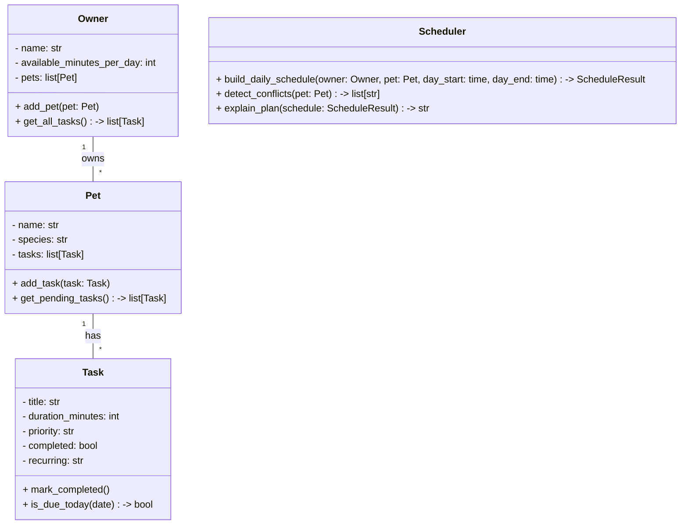

# PawPal+ Project Reflection

## 1. System Design

**a. Initial design**

- Briefly describe your initial UML design.
- What classes did you include, and what responsibilities did you assign to each?

I used four classes. Owner is in charge of storing the person's info and their list of pets. Pet holds the pet's details and keeps track of its tasks. Task stores what needs to be done, how long it takes, and how important it is. Scheduler builds the daily plan based on the owner's available time.

**Add a pet** — the owner enters basic info about themselves and their pet (like the pet's name and type).

**Add care tasks** — the user can create tasks like walks, feeding, or giving meds. Each task has a duration and a priority so the app knows what matters most.

**See a daily plan** — the app takes all the tasks and figures out a schedule for the day. It shows what to do and when, based on how much time the owner has and what the priorities are.

From those actions I came up with four main building blocks:

**Owner**
- Holds: name, how many minutes they have available in a day
- Can do: add a pet

**Pet**
- Holds: name, species, list of tasks
- Can do: add a task, return its list of tasks

**Task**
- Holds: task name, how long it takes (duration), how urgent it is (priority), whether it's done
- Can do: mark itself as complete

**Scheduler**
- Holds: a reference to the owner and their tasks
- Can do: generate a daily schedule based on time and priority

### b. UML class diagram (Mermaid.js)

**b. Design changes**

- Did your design change during implementation?
- If yes, describe at least one change and why you made it.

When I reviewed the skeleton, I noticed that `build_daily_schedule` only takes one `Pet` at a time, but an `Owner` can have multiple pets. That means the Scheduler can't see all the tasks across all pets at once, which could be a problem when the owner's time is shared between them. So I think the Scheduler should probably receive the full `Owner` object instead of just one pet, so it can plan across everything together.

## 2. Scheduling Logic and Tradeoffs

**a. Constraints and priorities**

- What constraints does your scheduler consider (for example: time, priority, preferences)?
- How did you decide which constraints mattered most?

**b. Tradeoffs**

- Describe one tradeoff your scheduler makes.
- Why is that tradeoff reasonable for this scenario?

The scheduler fits tasks into the day one at a time and skips any task that doesn't fit in the remaining time, even if a shorter lower-priority task could fit instead. So if a 60-minute task gets skipped, a 10-minute task after it might also get skipped even though there's still room for it. I kept it this way because it's simple and predictable — the owner always knows tasks are done in priority order, and adding "look-ahead" logic to squeeze in smaller tasks would make the code a lot harder to follow for a small app like this.

---

## 3. AI Collaboration

**a. How you used AI**

- How did you use AI tools during this project (for example: design brainstorming, debugging, refactoring)?
- What kinds of prompts or questions were most helpful?

**b. Judgment and verification**

- Describe one moment where you did not accept an AI suggestion as-is.
- How did you evaluate or verify what the AI suggested?

---

## 4. Testing and Verification

**a. What you tested**

- What behaviors did you test?
- Why were these tests important?

**b. Confidence**

- How confident are you that your scheduler works correctly?
- What edge cases would you test next if you had more time?

---

## 5. Reflection

**a. What went well**

- What part of this project are you most satisfied with?

**b. What you would improve**

- If you had another iteration, what would you improve or redesign?

**c. Key takeaway**

- What is one important thing you learned about designing systems or working with AI on this project?
